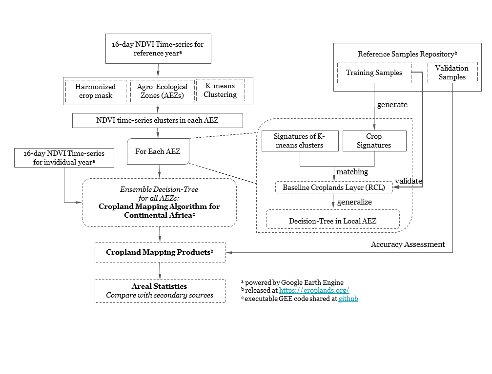
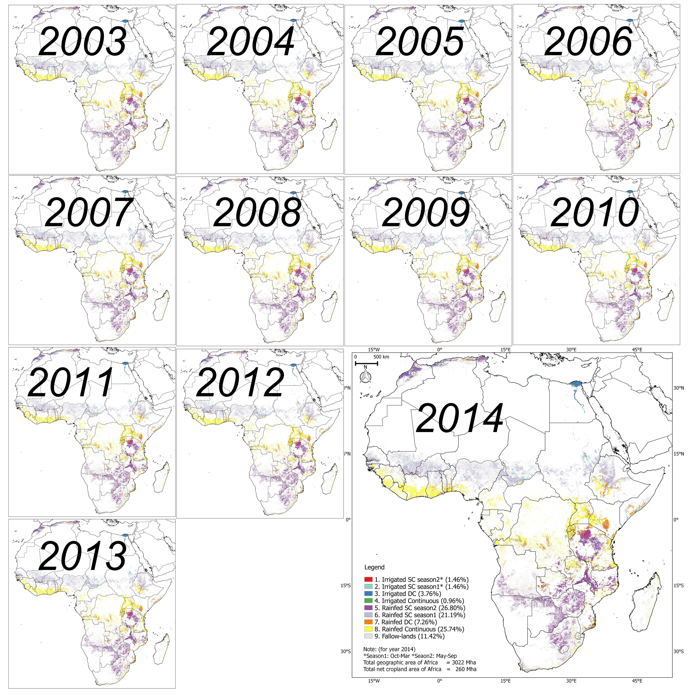

# ACM2016

This repo contains an automated cropland mapping algorithm (ACMA) for Africa using Moderate Resolution Imaging Spectroradiometer (MODIS) NDVI Time-series dataset, implemented by Google Earth Engine (GEE) JavaScript API. In general, this exact code was used by Jun Xiong to generate 250m global cropland product (GCP250m) for continental Africa. You can also read more on ACM2016 in a paper (Xiong and Thenkabail, 2016).

Google Earth Engine, based on millions of servers around the world and the start-of-the-art cloud-computing and storage capability, has archived a large catalog of earth observation data and enabled the scientific community to work on the trillions of images in parallel processing way. If you are not familar with Earth Engine, go [here](https://earthengine.google.com/) to get much idea about how to use it.

# How to use, test and report bugs of ACM2016

The runnable code is hosted on Earth Engine and under maintenance with [this link](https://code.earthengine.google.com/ce07c366433e44f4bc76def1b9efdbf3). You can either run this code in following ways:

1. Click on the [ACM2016 link](https://code.earthengine.google.com/ce07c366433e44f4bc76def1b9efdbf3) directly and open it in the GEE code editor;

2. Open a new GEE [code editor](code.earthengine.google.com) in the web browser and copy all the content of [gee_code_for_ACM2016.js](gee_code_for_ACM2016.js) to the code area, then click the **Run** button to run it.

To be able to run this code, a Google Earth Engine account is required. If you don't have it, you can go to [sign up](https://earthengine.google.com/signup/) to create one.

Unless otherwise noted, the Javascript code is orginal and any errors or ommissions should be attribued to me and not the aforemention authors.

# Methodology
ACM2016 was implemented as following steps:

First, MODIS 250 NDVI imagery composite of every 16-days was stratified by: (1) Mask out the non-crop area using 250m baseline crop mask of Africa, (2). Subset into 8 consolidated FAO agroecological zones (AEZs) and (3) clustered into unique clusters within individual AEZs using K-means method. Second, ground samples from reference samples repository were split into traing part and validation part. The former was used to generate crop signature to identify unique clusters and later was used to validate the identified results, which is called baseline Cropland Layer (RCL). Third, given the accuracy of RCL is satisfactory, the way to carry out classification in individual AEZs was generalized to a replicable decisio-tree, all the trees are ensemble to a complete automated algorithm which don’t need recalibration for entire Africa. 

# ACM2016 Algorithm
Instead of relying on in situ training data, the proposed method privileges the use of established baseline reference cropland layer, since it consists in the best possible land cover information available for each Agro-ecological Zone. The construction of decistion-tree algorithm is a procedure that recursively partitions a dataset into smaller subdivisions on the basis of a set of tests defined at each branch or node in the tree. The tree is composed of a root node (formed from training data), a set of internal nodes (splits), and a set of terminal nodes (leaves). A zonal tree rules are constructed by recursively partitioning the spectral distribution of the training dataset using WEKA (Sharma et al., 2013) and then expert-timed till the derived cropland product for the year 2014 (ACP2014) accurately matches with RCL2014. In zones where land cover features were misclassified and classification output was considered unsatisfactory, we added training data, redeveloped the decision tree models, and reapplied the models.

We used a decision tree approach to hierarchically classify crop types. The decision tree for each AEZ consisted of three steps: a) seperated using irrigation/rainfed masks, b) fallow cropland identification, c) decision-tree for primary classes in the individual AEZ based on . Fallow croplands were filtered out seperately for irrigation and rainfed: for irrigation area, area whose NDVI value lower than 0.2 in six months of one calendar year being excluded from the cropland area as fallow-land; for rainfed area, pixels  whose NDVI falls below a threshold during the peak growing seasons of the crop will be coded as cropland fallows.

# Dataset used

## 250m baseline crop mask for Africa

A baseline 250m cropland mask of Africa, including irrigation and rainfed part, was combined from 10 existing state-of-art studies of African and Global cropland studies:

|    Name   | Institution |   Data Source  | Resolution | Time interval |  Classes |                    Reference                    |
|:---------:|:-----------:|:--------------:|:----------:|:-------------:|:--------:|:-----------------------------------------------:|
| Globcover |     ESA     |      MERIS     |    300m    |   2005, 2009  | LULC     |                Arinoothers, 2010                |
| Africover |     FAO     |    Landsat 7   |     30m    |   1995-2002   | LULC     |                  Kalensky, 2014                 |
| LULC 2000 |     USGS    |      AVHRR     |    2000m   |      2000     | LULC     |               Soulard et al., 2014              |
| GLC 2000  |     JRC     |      SPOT      |   1/112°   |      2000     | LULC     |   Fritz, Hartley, Bartholomé, & Belward, 2000   |
| MCD12Q1   |     NASA    |      MODIS     |    500m    |   2004 - now  | LULC     | Leroux, Jolivot, Bégué, Seen, & Zoungrana, 2014 |
| MODIS-JRC |   JRC/MARS  | MODIS, Landsat |    250m    |      2009     | LULC     |              Vancutsem et al., 2013             |
| GCEV1     |     USGS    | MODIS, Landsat |    1000m   |      2010     | Cropland |             Teluguntla, et al., 2015            |
| Global30  |     NGCC    |    Landsat 7   |     30m    |      2010     | LULC     |                Chen et al., 2015                |
| FROMGC    |     CESS    |    Landsat 7   |     30m    |   Circa 2010  | LULC     |                Gong et al., 2013                |
| GRIPC     |      BU     |      MODIS     |    500m    |   Circa 2005  | Cropland |               Salmon, et al., 2015              |

This mask file was hosted on Earth Engine as image assset.

## MODIS NDVI times series product

The MODIS 250m 16-day composite NDVI product (MYD13, Didan, 2015) were found to have sufficient spatial and temporal resolutions to detect cropland over large area (Wardlow et al., 2005).  In Section 3, NDVI time-series spanning the entire year (January–December 2014) was created for the continental Africa, because of its strength in overcoming the high probability of cloud cover and\or harmattan haze during the monsoon season over much of Africa (Leroux et al., 2014; Vintrou et al., 2012). Hosted on Google Earth Engine, the MYD13 product are computed from daily atmospherically corrected bi-directional surface reflectances that have been masked for water, clouds, heavy aerosols, and cloud shadows.  

# Classification system

The ACM2016 will generate a class map consisted of following classes:

| Class id |           Label          |                   Dominant Crop Classes                   |
|:--------:|:------------------------:|:---------------------------------------------------------:|
|     1    | Irrigated, SC, season 2* |                       wheat, barley                       |
|     2    | Irrigated, SC, season 1* |                    maize, rice, millet                    |
|     3    |      Irrigated, DC,      |              rice/chili-vegetable, rice-rice              |
|     4    |   Irrigated, Continuous  |                   sugarcane, plantation                   |
|     5    |   Rainfed, SC, season 2  |         millet, barley, maize, beans, cassava, yam        |
|     6    |   Rainfed, SC, season 1  |      maize, sorghum, tef, wheat, barley, cassava, yam     |
|     7    |       Rainfed, DC,       | rice-rice, maize-maize, rice-beans/potato/chickpea/pulses |
|     8    |    Rainfed, Continuous   |                   sugarcane, plantation                   |
|     9    |       Fallow-lands       |                                                           |

Where season 1 is from Oct through March and season 2 is May through September.

# Output
We applied ACM2016 algorithm for the years 2003 through 2014 using MODIS 250 m every 16-day time-series data on Google Earth Engine.The net cropland areas (NCAs) Africa increase by about 10 Mha from 2003 to 2014, going from 250 Mha to 270 Mha and, the gross cropland areas (GCAs) Africa increase by about 10 Mha from 2003 to 2014, going from 310 Mha to 325 Mha. To summerize, the cropland fallows of Africa decrease by about 10 Mha from 2003 to 2014, going from 43 Mha to 30 Mha. From 2003 to 2014 there is 10 Mha in cropland area increase and another 10 Mha of cropland fallow decrease. Roughly an increase of 1 Mha of croplands per year. This can only increase further with rapid increase in population and increasing food and nutritional demands of the populations. 

Figure. ACM2016 derived cropland products of Africa year after year from year 2003 through the year 2014.

# Citation
TBD

# Contact
If you have any questions, feel free to write to [jxiong@usgs.gov](mailto:jxiong@usgs.gov)

More details about our project and product can be found at: [croplands.org](https://croplands.org/)

# Reference
- Gong, P., Wang, J., Yu, L., Zhao, Y., Zhao, Y., Liang, L., Niu, Z., Huang, X., Fu, H., Liu, S., Li, C., Li, X., Fu, W., Liu, C., Xu, Y., Wang, X., Cheng, Q., Hu, L., Yao, W., Zhang, H., Zhu, P., Zhao, Z., Zhang, H., Zheng, Y., Ji, L., Zhang, Y., Chen, H., Yan, A., Guo, J., Yu, L., Wang, L., Liu, X., Shi, T., Zhu, M., Chen, Y., Yang, G., Tang, P., Xu, B., Giri, C., Clinton, N., Zhu, Z., Chen, J., Chen, J., 2013. Finer resolution observation and monitoring of global land cover: first mapping results with Landsat TM and ETM+ data. International Journal of Remote Sensing 34, 2607–2654. doi:10.1080/01431161.2012.748992
- Salmon, J.M., Friedl, M.A., Frolking, S., Wisser, D., Douglas, E.M., 2015. Global rain-fed, irrigated, and paddy croplands: A new high resolution map derived from remote sensing, crop inventories and climate data. International Journal of Applied Earth Observation and Geoinformation 38. doi:10.1016/j.jag.2015.01.014
- Thenkabail, P.S., Biradar, C.M., Noojipady, P., Dheeravath, V., Li, Y., Velpuri, M., Gumma, M., Gangalakunta, O.R.P., Turral, H., Cai, X., Vithanage, J., Schull, M.A., Dutta, R., 2009. Global irrigated area map (GIAM), derived from remote sensing, for the end of the last millennium. International Journal of Remote Sensing 30, 3679–3733. doi:10.1080/01431160802698919
- Thenkabail, P.S., Wu, Z., 2012. An Automated Cropland Classification Algorithm (ACCA) for Tajikistan by Combining Landsat, MODIS, and Secondary Data. Remote Sensing 4. doi:10.3390/rs4102890
- Vancutsem, C., Marinho, E., Kayitakire, F., See, L., Fritz, S., 2012. Harmonizing and Combining Existing Land Cover/Land Use Datasets for Cropland Area Monitoring at the African Continental Scale. Remote Sensing 5. doi:10.3390/rs5010019
- Waldner, F., Canto, G.S., Defourny, P., 2015. Automated annual cropland mapping using knowledge-based temporal features. ISPRS Journal of Photogrammetry and Remote Sensing 110. doi:10.1016/j.isprsjprs.2015.09.013
